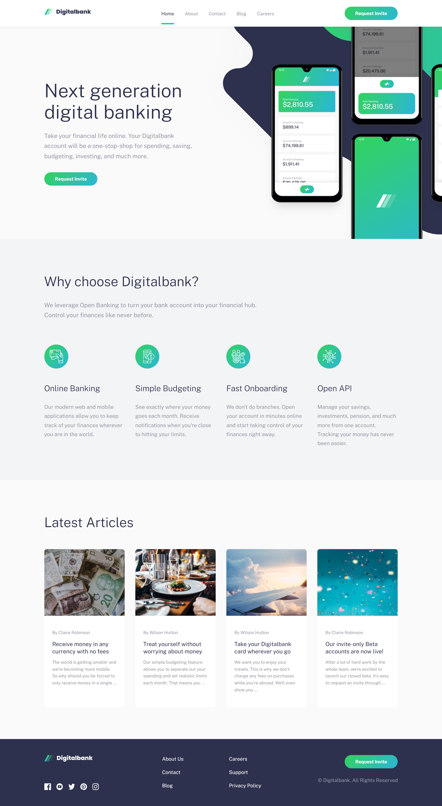

# Frontend Mentor - Digitalbank Landing Page Solution

This is my solution to the **Digitalbank Landing Page** challenge on Frontend Mentor. It helped me practice responsive design and build a clean layout using basic web technologies.

## Table of contents
- [Overview](#overview)
- [The challenge](#the-challenge)
- [Screenshot](#screenshot)
- [Links](#links)
- [My process](#my-process)
- [Built with](#built-with)
- [What I learned](#what-i-learned)
- [Continued development](#continued-development)
- [Author](#author)

## Overview

### The challenge
Users should be able to:
- View a responsive layout across different devices
- See hover states on all interactive elements

### Screenshot

## Links
- **Solution URL:** https://github.com/AnilaAnilaN/DigitalBank_LandingPage  
- **Live Site URL:** https://anilaanilan.github.io/DigitalBank_LandingPage/
## My process

### Built with
- HTML5  
- CSS (custom properties, Flexbox, Grid)  
- JavaScript  
- Mobile-first workflow  

### What I learned
While building this landing page, I practiced structuring layouts with Flexbox and Grid, setting up consistent spacing with CSS variables, and adding minor interactions using JavaScript. It also improved my mobile-first design approach.

### Continued development
I plan to rebuild this full project with Next.js and Tailwind CSS to make it more scalable and easier to maintain.

## Author
- **Website:** [Anila Nawaz](https://anila-portfolio-next-js.vercel.app/)  
- **Frontend Mentor:** [@anilanawaz](https://www.frontendmentor.io/profile/AnilaAnilaN)
